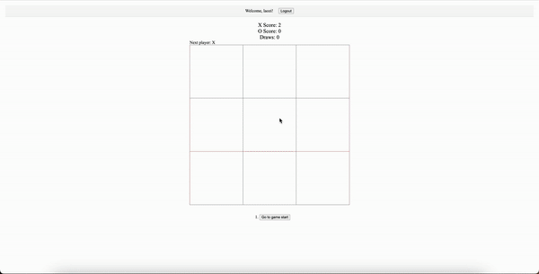

**ReactTicTac** is the classic tic-tac-toe game built with React.

## Features

- Fun tic-tac-toe gameplay
- Unique accounts
- Offline mode
- Account statistics
- Play against a bot
- Various bot difficulties
- Online play
- Leaderboard (**_COMING SOON!!_**)

## Technologies Used

- React
- NodeJS
- MongoDB
- RESTful API's
- bcrypt
- JWT
- Socket.io

## Installation

**_WIP_**
